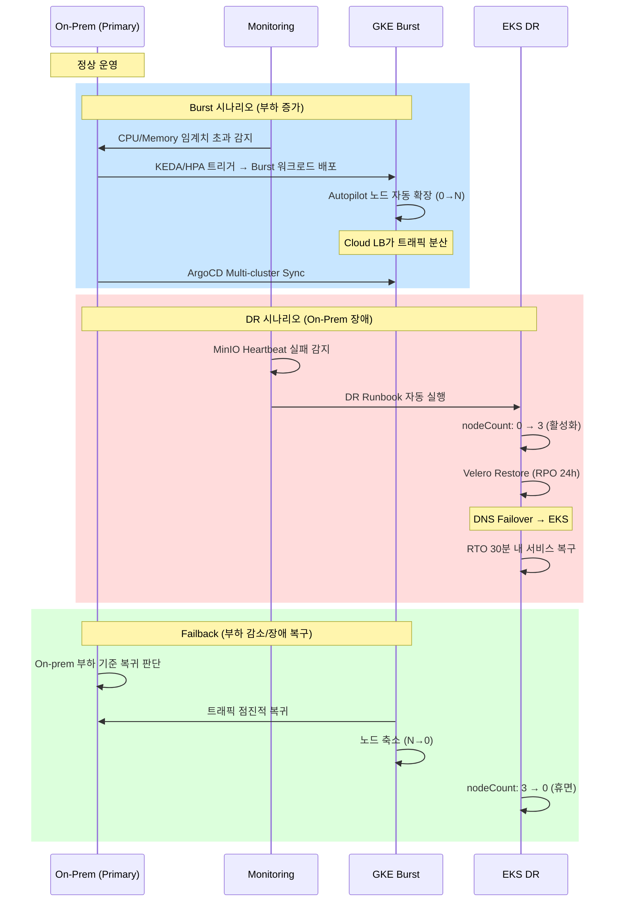

# k8s-idp 클러스터 아키텍처

```mermaid
graph TB
    %% ─── External Layer ──────────────────────────────────────
    subgraph EXTERNAL["☁️ 외부 서비스"]
        HEADSCALE["Headscale VPN<br/>GCP e2-micro<br/>(항시 가동)"]
        GITHUB["GitHub<br/>sydk-ktcloud/k8s-idp"]
        DISCORD["Discord<br/>#라이프사이클-알림"]
    end

    %% ─── Cloud Load Balancer ─────────────────────────────────
    CLB["Cloud Load Balancer<br/>Hybrid NEG<br/>(Weight-based Routing)"]

    %% ─── On-Prem Cluster ────────────────────────────────────
    subgraph ONPREM["🏢 On-Prem Kubernetes Cluster (Primary)"]
        direction TB

        subgraph NODES["노드 구성"]
            CP["k8s-cp<br/>Control Plane<br/>4C/16GB<br/>192.168.122.109"]
            W1["k8s-w1<br/>Worker<br/>8C/32GB<br/>192.168.122.211"]
            W2["k8s-w2<br/>Worker<br/>8C/32GB<br/>192.168.122.136"]
            W3["k8s-w3<br/>Worker<br/>8C/32GB<br/>192.168.122.194"]
        end

        subgraph GITOPS["GitOps & 인증"]
            ARGOCD["ArgoCD<br/>:30443<br/>36+ Apps 관리"]
            DEX["Dex OIDC<br/>:30556"]
            RUNNER["GitHub Actions<br/>Runner x2"]
        end

        subgraph PLATFORM["플랫폼 서비스"]
            BACKSTAGE["Backstage IDP<br/>:30070<br/>x2 replicas"]
            BACKSTAGE_PG["PostgreSQL<br/>5GB PVC"]
            VAULT["Vault<br/>Raft x1<br/>10GB PVC"]
            ESO["External Secrets<br/>Operator"]
            CHATOPS["ChatOps Bot"]
        end

        subgraph MESH["서비스 메시 & 네트워크"]
            CILIUM["Cilium CNI<br/>DaemonSet x4"]
            ISTIO["Istio Ambient<br/>istiod + ztunnel x4"]
            NETPOL["Network Policies<br/>54 rules"]
        end

        subgraph CROSSPLANE["Crossplane IaC"]
            XP_CORE["Crossplane Core"]
            subgraph PROVIDERS["프로바이더"]
                AWS_P["AWS<br/>EC2/S3/EKS/RDS"]
                GCP_P["GCP<br/>Compute/Container/Storage"]
                AZURE_P["Azure<br/>Compute/Storage/DB<br/>⚠️ Network CrashLoop"]
            end
            subgraph XRDS["XRD Compositions"]
                XRD_VM["GCPInstance / EC2 / AzureVM"]
                XRD_ST["Bucket / S3 / AzureBlob"]
                XRD_DB["Database / RDS / AzureDB"]
                XRD_CL["Cluster / EKS / AKS"]
                XRD_BURST["ClusterBurst (GKE)"]
            end
        end

        subgraph OBSERVE["관측성"]
            PROM["Prometheus<br/>20GB PVC"]
            GRAFANA["Grafana<br/>:30080<br/>1GB PVC"]
            LOKI["Loki<br/>10GB PVC"]
            TEMPO["Tempo<br/>10GB PVC"]
            ALLOY["Alloy<br/>OTEL Collector<br/>DaemonSet x3"]
            KUBECOST["Kubecost<br/>128GB PVC"]
        end

        subgraph SECURITY["보안"]
            FALCO["Falco Runtime<br/>DaemonSet x4"]
            TALON["Falco Talon<br/>자동 대응 x2"]
            KYVERNO["Kyverno<br/>⚠️ CrashLoop"]
            TRIVY["Trivy Scanner"]
            CERTMGR["Cert Manager"]
        end

        subgraph STORAGE["스토리지"]
            LONGHORN["Longhorn<br/>분산 스토리지<br/>DaemonSet x3"]
            MINIO["MinIO<br/>S3 호환<br/>50GB PVC"]
            LOCALPATH["Local Path<br/>Provisioner"]
        end

        subgraph WORKLOAD["워크로드"]
            TRIP["trip-app<br/>Backend/Frontend<br/>Cart/Payment<br/>PostgreSQL"]
            KEDA_W["KEDA<br/>이벤트 기반 오토스케일링"]
        end

        subgraph BACKUP["백업 & DR"]
            VELERO["Velero<br/>Backup Manager"]
            LIFECYCLE["Lifecycle Scanner<br/>CronJob"]
        end
    end

    %% ─── GKE Burst Cluster ──────────────────────────────────
    subgraph GKE["☁️ GKE Burst Cluster (Overflow)"]
        direction TB
        GKE_INFO["GKE Autopilot<br/>asia-northeast3<br/>0-5 nodes (Preemptible)<br/>e2-standard-4"]
        GKE_ARGOCD["ArgoCD Agent<br/>(On-prem에서 관리)"]
        GKE_WORKLOAD["Burst 워크로드<br/>HPA 기반 자동 확장"]
        GKE_STATUS["상태: 프로비저닝 중<br/>VPN 연결 대기"]
    end

    %% ─── EKS DR Cluster ─────────────────────────────────────
    subgraph EKS["☁️ EKS DR Cluster (Dormant)"]
        direction TB
        EKS_INFO["EKS Cluster<br/>AWS<br/>nodeCount: 0 (휴면)"]
        EKS_RESTORE["Velero Restore<br/>RPO: 24h / RTO: 30min"]
        EKS_STATUS["상태: 휴면<br/>On-prem 장애 시 자동 활성화"]
    end

    %% ─── Shared Cloud Services ──────────────────────────────
    subgraph CLOUD["☁️ 공유 클라우드 서비스"]
        S3_DR["AWS S3 Bucket<br/>sydk-velero-dr-usw2<br/>sydk-longhorn-dr-usw2"]
        CLOUD_SQL["Cloud SQL<br/>(계획)"]
    end

    %% ─── Connections ─────────────────────────────────────────

    %% External connections
    GITHUB -->|"GitOps Push"| ARGOCD
    GITHUB -->|"Webhook"| RUNNER
    HEADSCALE -.->|"VPN Mesh"| CP
    HEADSCALE -.->|"VPN Mesh"| GKE_INFO
    HEADSCALE -.->|"VPN Mesh"| EKS_INFO

    %% Load Balancer routing
    CLB -->|"Baseline Traffic"| ONPREM
    CLB -->|"Burst Traffic"| GKE

    %% GitOps flow
    ARGOCD -->|"Sync 36+ Apps"| ONPREM
    ARGOCD -->|"Multi-cluster"| GKE_ARGOCD
    RUNNER -->|"CI/CD"| ARGOCD

    %% Platform connections
    BACKSTAGE --> BACKSTAGE_PG
    BACKSTAGE -->|"Crossplane Catalog"| XP_CORE
    BACKSTAGE -->|"Discord 알림"| DISCORD
    BACKSTAGE --> DEX
    ESO --> VAULT

    %% Crossplane provisioning
    XP_CORE --> AWS_P & GCP_P & AZURE_P
    GCP_P -->|"Provision"| GKE
    AWS_P -->|"Provision"| EKS
    XRD_BURST -->|"GKE Burst"| GKE_INFO

    %% Observability flow
    ALLOY -->|"Metrics"| PROM
    ALLOY -->|"Logs"| LOKI
    ALLOY -->|"Traces"| TEMPO
    GRAFANA --> PROM & LOKI & TEMPO
    FALCO -->|"Alerts"| TALON

    %% Storage & Backup
    LONGHORN -->|"Daily Backup"| MINIO
    MINIO -->|"S3 Replication"| S3_DR
    VELERO -->|"Backup"| S3_DR
    VELERO -.->|"DR Restore"| EKS_RESTORE

    %% DR flow
    EKS_RESTORE -->|"Restore from S3_DR"| S3_DR

    %% Service Mesh
    ISTIO -->|"mTLS"| TRIP
    ISTIO -->|"mTLS"| BACKSTAGE

    %% Styles
    classDef primary fill:#2563eb,stroke:#1d4ed8,color:#fff
    classDef secondary fill:#7c3aed,stroke:#6d28d9,color:#fff
    classDef warning fill:#f59e0b,stroke:#d97706,color:#000
    classDef danger fill:#ef4444,stroke:#dc2626,color:#fff
    classDef cloud fill:#06b6d4,stroke:#0891b2,color:#fff
    classDef storage fill:#10b981,stroke:#059669,color:#fff
    classDef security fill:#ec4899,stroke:#db2777,color:#fff
    classDef dormant fill:#6b7280,stroke:#4b5563,color:#fff

    class CP,W1,W2,W3 primary
    class ARGOCD,BACKSTAGE secondary
    class AZURE_P,KYVERNO warning
    class GKE_INFO,EKS_INFO cloud
    class LONGHORN,MINIO,S3_DR storage
    class FALCO,TALON,TRIVY security
    class EKS_STATUS,EKS_RESTORE dormant
```

## 아키텍처 요약

| 구성 요소 | 상태 | 설명 |
|-----------|------|------|
| **On-Prem 클러스터** | ✅ 운영 중 | 4노드 (1 CP + 3 Worker), 32C/112GB |
| **GKE Burst** | 🔄 프로비저닝 중 | asia-northeast3, Autopilot 0-5 nodes |
| **EKS DR** | 💤 휴면 | nodeCount=0, 장애 시 자동 활성화 |
| **Crossplane** | ⚠️ 부분 이슈 | Azure Network 프로바이더 CrashLoop |
| **관측성** | ✅ 정상 | Prometheus + Loki + Tempo + Grafana |
| **보안** | ⚠️ 부분 이슈 | Kyverno CrashLoop, Falco 정상 |
| **백업** | ✅ 정상 | Velero + Longhorn → AWS S3 |

## DR/Burst 전환 흐름

