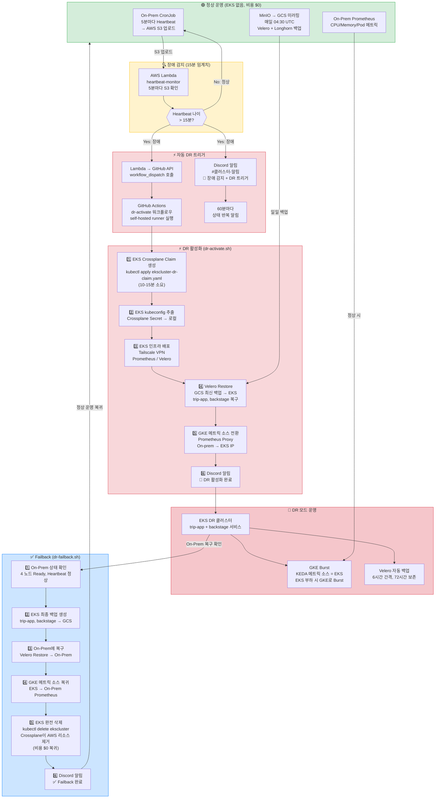
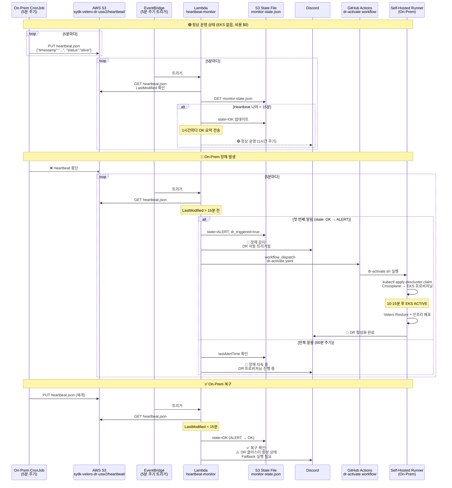
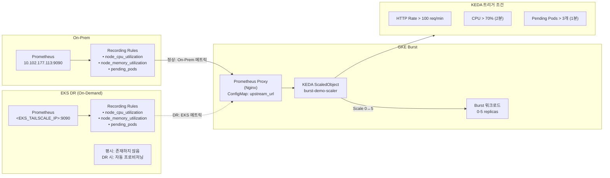

# DR 클러스터 발동 흐름도 (Active-Passive On-Demand)

> **모델**: 평시 EKS 클러스터 없음 (비용 $0) → 장애 감지 시 자동 프로비저닝 → 복구 후 완전 삭제

## 1. 전체 DR 발동 흐름 (장애 감지 → 자동 프로비저닝 → 복구 → 복귀)



## 2. Heartbeat 기반 Dead Man's Switch + 자동 DR 트리거 상세



## 3. GKE Burst & DR 메트릭 소스 전환



---

## 비용 비교

| 항목 | 기존 (Dormant) | 현재 (On-Demand) |
|------|---------------|-----------------|
| **평시 EKS 비용** | ~$73/월 (Control Plane) | **$0** |
| **평시 노드 비용** | $0 (nodeCount=0) | **$0** (클러스터 없음) |
| **DR 활성화 시간** | 3-5분 (노드 scale-up) | 10-15분 (클러스터 생성) |
| **DR 비용** | Control Plane + 노드 | Control Plane + 노드 |
| **Failback 후** | Control Plane 유지 | **완전 삭제, $0** |
| **트레이드오프** | 빠른 복구 | 비용 절감, 느린 복구 |

## 알람 메커니즘 정리

### 알람 채널별 분류

| 채널 | 발신 주체 | 트리거 | 내용 |
|------|----------|--------|------|
| **Discord #클러스터-알림** | AWS Lambda | Heartbeat 15분 미갱신 | 🚨 장애 감지 + DR 자동 트리거 알림 |
| **Discord #클러스터-알림** | AWS Lambda | ALERT → OK 전환 | ✅ 복구 확인 + Failback 안내 |
| **Discord #라이프사이클-알림** | Backstage Provider | Crossplane 리소스 Ready 전환 | 리소스 프로비저닝 완료 알림 |
| **Discord #라이프사이클-알림** | Lifecycle Scanner CronJob | 매일 08:00 UTC | 만료 예정/만료 리소스 삭제 알림 |
| **Alertmanager → Discord** | Prometheus Rules | 메트릭 임계치 초과 | Backup 실패, 스토리지 부족, Burst 트리거 |
| **Discord (Cloud Credits)** | Cloud Credit Monitor | 매시간 | AWS/GCP/Azure 비용 리포트 |
| **Discord (DR 스크립트)** | dr-activate.sh / dr-failback.sh | 자동/수동 실행 | DR 활성화/복귀 완료 알림 |

### 알람 흐름 요약

```
1. 장애 감지 + 자동 DR 체인:
   On-Prem CronJob (5분) → S3 Heartbeat → Lambda (5분) → 15분 임계
   → Discord 알림 + GitHub Actions workflow_dispatch
   → Self-Hosted Runner → dr-activate.sh
   → Crossplane EKS Claim Apply → EKS 프로비저닝 (10-15분)
   → Velero Restore → 서비스 복구

2. Burst 트리거 체인:
   Prometheus 메트릭 → PrometheusRule 알림 → KEDA ScaledObject → GKE Pod Scale-Up

3. 백업 실패 체인:
   Velero/Longhorn 에러 → PrometheusRule → Alertmanager → Discord 알림

4. Failback 체인:
   Lambda 복구 알림 → 운영자 확인 → dr-failback.sh
   → EKS 최종 백업 → On-Prem 복구 → EKS Claim 삭제 (완전 제거)
   → 비용 $0 복귀
```

### Split-Brain 방지

1. **15분 임계치**: 네트워크 순단 등 false positive 방지
2. **수동 Failback**: 자동 복구 시 flip-flop 방지, 운영자 판단 필수
3. **Lambda 상태 파일**: S3에 `monitor-state.json` 저장, ALERT/OK 전환 + `dr_triggered` 플래그 추적
4. **60분 반복 알림**: 알림 폭주 방지, 상태 변경 시에만 즉시 발송
5. **EKS 존재 여부 체크**: `dr-activate.sh`가 이미 EKS가 존재하면 중복 생성 방지
6. **GitHub Actions 멱등성**: 워크플로우가 EKS ACTIVE 상태면 재프로비저닝 건너뜀
